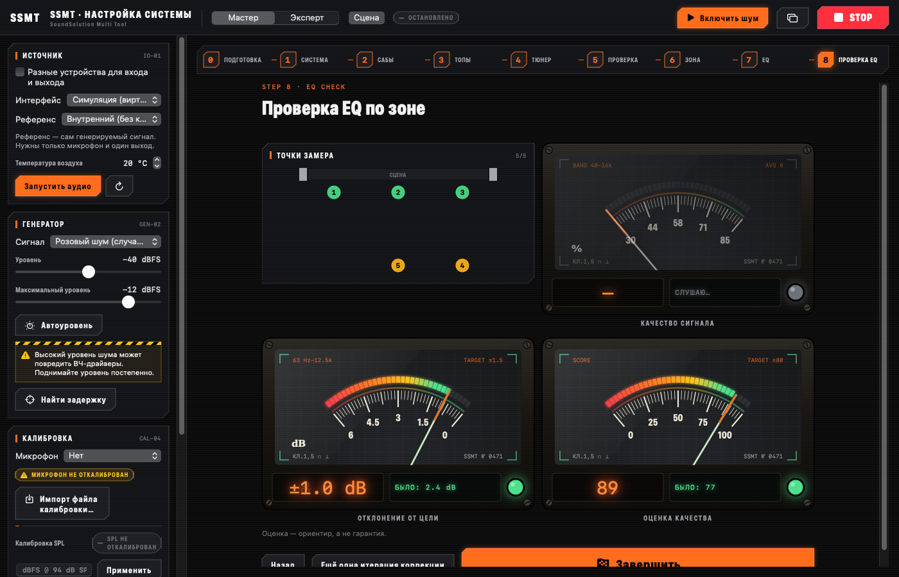
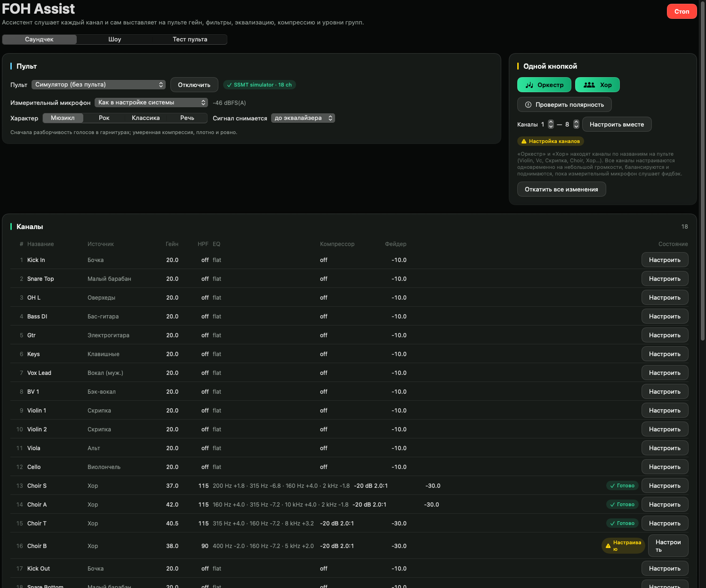

# SSMT — SoundSolution Multi Tool

**Рабочий инструмент звукорежиссёра и инженера на macOS: настройка системы, input list, плейбек шоу и ассистент за пультом — в одной программе.**

[Скачать последнюю версию](../../releases/latest) · [Руководство (RU)](docs/USER_GUIDE.ru.md) · [User guide (EN)](docs/USER_GUIDE.en.md) · [Установка](docs/INSTALL.md)



## Зачем

Каждый выезд начинается с одного и того же: выставить сабы с порталами, найти задержку, поправить EQ, собрать
input list и план сцены, подготовить фонограммы, прогнать саундчек по каждому каналу, а потом весь концерт следить,
чтобы не завёлся фидбэк и не зазвенел монитор. Это часы рутины, которая делается вручную, разными программами и
каждый раз заново.

SSMT собирает эту рутину в одно место и берёт её на себя там, где машина справляется не хуже человека: измеряет,
считает, подсказывает и настраивает, а решение и микс остаются за звукорежиссёром.

## Что умеет

**1. Настройка системы.** Пошаговый мастер для выстраивания сабвуферов и порталов: измерение двухканальным FFT,
поиск задержки и полярности, совмещение саба с порталами, предложения EQ по стандартным частотам процессора,
проверка после ввода и отчёт в PDF. Поддерживаются калибровочные файлы измерительных микрофонов и типовые профили.

**2. Input list и стейдж-план.** Каналы из шаблонов, мониторные миксы, сводка «что выдать на сцену» (микрофоны,
DI, стойки, +48 V) и план сцены. Экспорт в PDF, PNG и CSV — готовый райдер для площадки.

**3. Qtrl — Show Control Center.** Плейбек шоу из кью: аудио с точным до сэмпла стартом, фейды, группы, паузы,
OSC-команды для света, видео и пультов (Resolume, ETC Eos, grandMA3, MagicQ, X32/M32, QLab), кнопки one-shot,
таймлайн, «Стоп всё» и защита от двойного GO.

**4. FOH Assist (beta).** Ассистент за пультом Behringer X32 / Midas M32 и X Air / MR — подключается по Wi-Fi через
роутер, как Mixing Station:
- **саундчек сам:** каждый канал доводится до «Готово» — гейн, срез НЧ, эквализация, компрессия; оркестр или хор
  одной кнопкой по названиям каналов на пульте; баланс и подъём с проверкой фидбэка; характер — мюзикл, рок,
  классика, речь;
- **полярность:** сам щёлкает полярность пар микрофонов (kick in/out, snare top/bottom…) и оставляет правильную;
- **страховка на шоу:** микс ведёте вы, ассистент не трогает фейдеры каналов — вырезает фидбэк, прижимает
  зазвеневший монитор и возвращает его, держит солиста разборчивым в массовых сценах; что вы тронули — не трогает;
- **тест пульта и симуляция шоу:** проверка всей работы с вашим пультом на выдуманном шоу, с возвратом пульта как был.

| Input list и сцена | Qtrl | FOH Assist |
|---|---|---|
|  |  |  |

## Почему это решение

- **Быстрее.** Настройка системы и саундчек, которые занимают часы, сводятся к шагам «измерить — проверить — готово».
- **Повторяемо.** Измерения, а не «на слух в шуме зала»: результат можно проверить, сохранить в отчёт и повторить на следующей площадке.
- **Безопасно.** Ассистент правит в пределах нескольких дБ, всё отменяется одной кнопкой, а любое касание звукорежиссёра главнее автоматики.
- **Одна программа вместо пяти.** Измерения, райдер, плейбек и связь с пультом — в одном окне, без переключения между приложениями.
- **Работает без железа.** Встроенные симуляторы (виртуальный зал, виртуальный пульт) — чтобы научиться и проверить всё до выезда.

## Требования

macOS 13 или новее, Apple Silicon или Intel. Для измерений — звуковая карта и измерительный микрофон.
Для FOH Assist — пульт Behringer X32 / Midas M32 или X Air / MR в той же сети, что и Mac.

**Статус.** Функции 1–3 — рабочие, покрыты тестами. FOH Assist — beta: протокол X32 взят из открытого описания и ещё не сверен
с живым пультом; начните с «Теста пульта». Подробно: [`docs/STATUS.md`](docs/STATUS.md).

---

## English

**SSMT is a macOS workstation tool for live sound engineers and system techs: system alignment, input lists,
show playback and a console assistant in one app.**

- **System setup:** guided sub ↔ mains alignment from dual-channel FFT measurements, delay and polarity, EQ
  suggestions on standard processor frequencies, verification and a PDF report; measurement-mic calibration files.
- **Input list & stage plan:** channels from templates, monitor mixes, a pull list, a stage plot; PDF / PNG / CSV.
- **Qtrl — Show Control Center:** cue-based playback with sample-accurate starts, fades, groups, OSC to lighting,
  video and consoles, one-shot pads, a timeline, two-stage Stop all.
- **FOH Assist (beta):** connects to X32 / M32 and X Air over Wi-Fi like Mixing Station; tunes channels by itself
  (gain, high-pass, EQ, compression), one-button orchestra and choir, automatic polarity check, and a show guard
  that backs up the engineer (feedback, monitor loops, lead intelligibility) without moving channel faders;
  console test and show simulation.

Why: hours of routine on every gig — alignment, soundcheck, playback prep, watching for feedback — become a few
measured, repeatable, undoable steps, while the mix stays in the engineer's hands. Requires macOS 13+.

---

## For developers

| Path | What |
|---|---|
| `Packages/SSMTCore` | DSP, measurement engine, FOH Assist logic, simulation (no UI, no Core Audio). Tested on macOS and Linux. |
| `Packages/SSMTCore/Sources/SSMTRealtime` | C11 lock-free ring buffer and atomics for the audio thread |
| `Packages/SSMTAudio` | Core Audio HAL (AUHAL) duplex backend, device catalog |
| `App/SSMT` | SwiftUI app |
| `project.yml` | XcodeGen project spec |

```sh
brew install xcodegen      # free, build-time only
xcodegen generate
open SSMT.xcodeproj         # or: xcodebuild -scheme SSMT -configuration Release build
```

Core tests: `swift test -c release --package-path Packages/SSMTCore`
(on Linux without a toolchain: `scripts/linux-swift.sh swift test -c release --package-path Packages/SSMTCore`).
Snapshot tests (macOS): `xcodebuild test -scheme SSMT -configuration Debug -destination 'platform=macOS'`;
references live in `App/Tests/Snapshots/References` (CI records missing ones).
Release: push a tag `vX.Y.Z`, or run the CI workflow with `release_tag` → CI builds, ad-hoc signs, packages
`SSMT-X.Y.Z.pkg` and publishes a GitHub Release. UI strings: `scripts/strings.py` (en + ru).

Docs: [plan](docs/PLAN.md) · [assumptions](docs/ASSUMPTIONS.md) · [status](docs/STATUS.md) ·
[acceptance](docs/ACCEPTANCE.md) · [release notes](docs/RELEASE_NOTES.md) · [changelog](docs/CHANGELOG.md)
