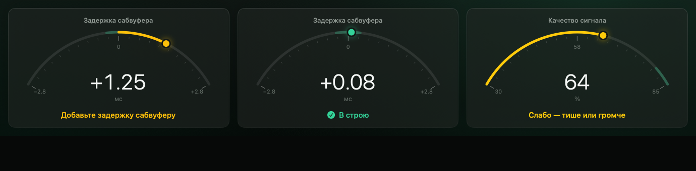

# SSMT — SoundSolution Multi Tool

Native macOS app (13+, Apple Silicon + Intel) for sound engineers. Feature #1: guided automatic
system setup — subwoofer ↔ mains alignment and EQ suggestions from dual-channel FFT measurements.

- **Install:** [`docs/INSTALL.md`](docs/INSTALL.md) · **User guide:** [RU](docs/USER_GUIDE.ru.md) · [EN](docs/USER_GUIDE.en.md)
- Plan: [`docs/PLAN.md`](docs/PLAN.md) · Assumptions: [`docs/ASSUMPTIONS.md`](docs/ASSUMPTIONS.md)
- Status: [`docs/STATUS.md`](docs/STATUS.md) · Acceptance: [`docs/ACCEPTANCE.md`](docs/ACCEPTANCE.md)
- Release notes: [`docs/RELEASE_NOTES.md`](docs/RELEASE_NOTES.md) · Changelog: [`docs/CHANGELOG.md`](docs/CHANGELOG.md)



## Layout

| Path | What |
|---|---|
| `Packages/SSMTCore` | DSP, measurement engine, simulation (no UI, no Core Audio). Fully tested on macOS and Linux. |
| `Packages/SSMTCore/Sources/SSMTRealtime` | C11 lock-free ring buffer and atomics for the audio thread |
| `Packages/SSMTAudio` | Core Audio HAL (AUHAL) duplex backend, device catalog |
| `App/SSMT` | SwiftUI app |
| `project.yml` | XcodeGen project spec |

## Build

```sh
brew install xcodegen      # free, build-time only
xcodegen generate
open SSMT.xcodeproj         # or: xcodebuild -scheme SSMT -configuration Release build
```

Core tests: `swift test -c release --package-path Packages/SSMTCore`
(on Linux without a toolchain: `scripts/linux-swift.sh swift test -c release --package-path Packages/SSMTCore`).

Snapshot tests (macOS): `xcodebuild test -scheme SSMT -configuration Debug -destination 'platform=macOS'`;
images go to `build/snapshots`, references live in `App/Tests/Snapshots/References` (CI records missing ones).

Release: push a tag `vX.Y.Z` → CI builds, ad-hoc signs, packages `SSMT-X.Y.Z.pkg` and publishes a GitHub Release.

UI strings live in `scripts/strings.py` (en + ru); run `python3 scripts/strings.py generate` after editing.
