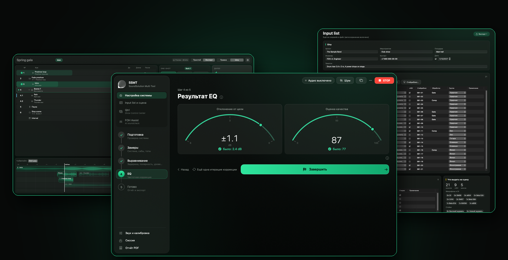
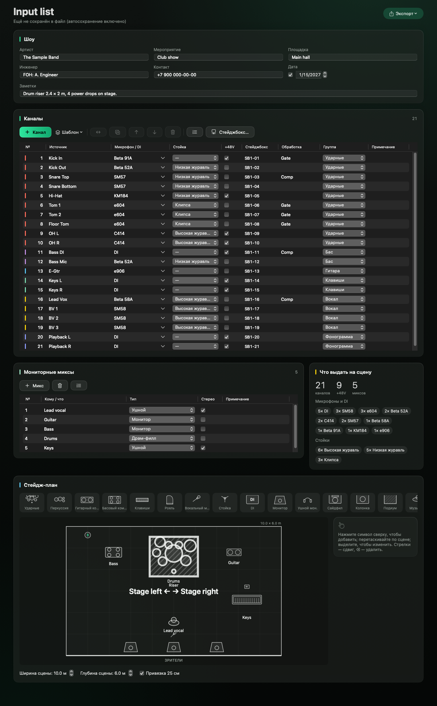
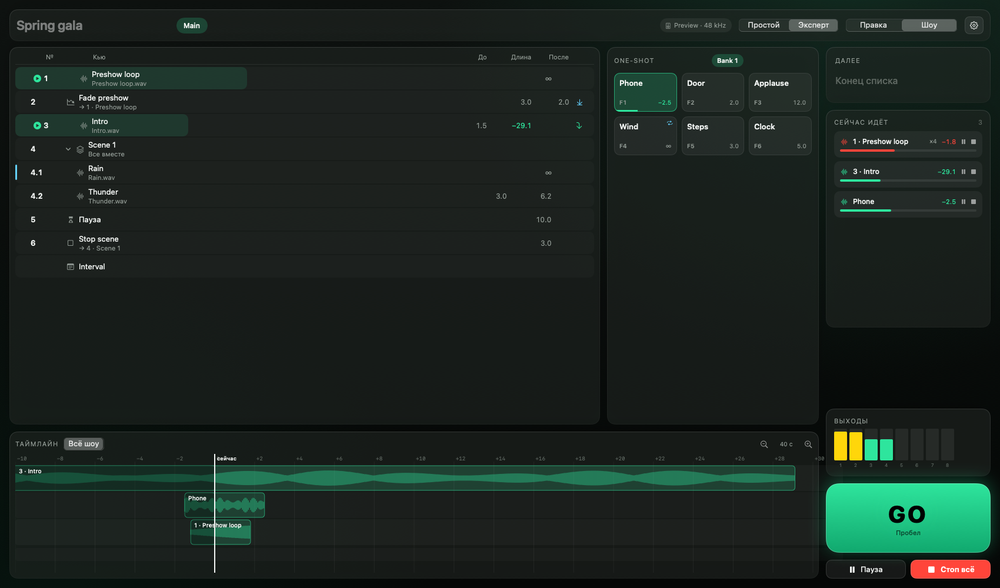
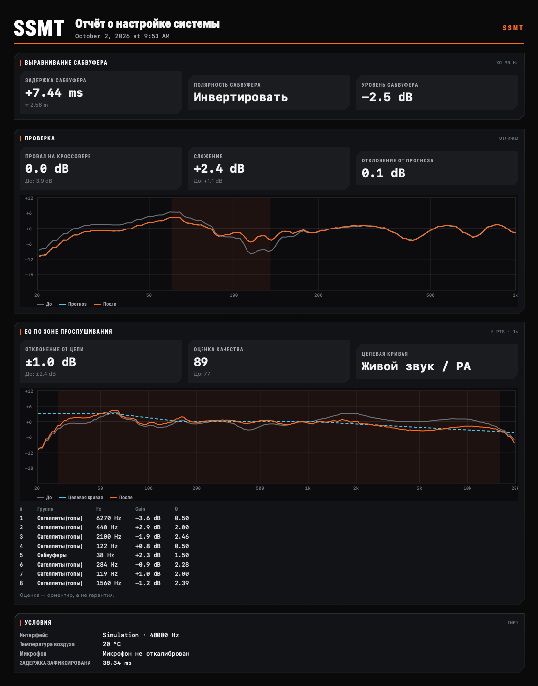

<div align="center">


# SSMT — SoundSolution Multi Tool

**Программный комплекс для звукорежиссёров и системных инженеров на macOS**<br>
настройка звуковых систем · коммутационные листы · воспроизведение фонограмм · ассистент управления микшерным пультом

[](../../releases/latest)
[](../../actions/workflows/ci.yml)




</div>

> [!NOTE]
> **FOH Assist — бета-версия.** Взаимодействие с Behringer X32 / Midas M32 и X Air / MR реализовано
> на основе открытого описания протокола. Работа с физическим оборудованием пока не проверена.
> Для первичной проверки предусмотрен режим «Тест пульта» с восстановлением исходных настроек после завершения.

## Скачать

| Что | Для кого | Где |
|---|---|---|
| **SSMT** (установщик `.pkg`) | macOS 13+, Apple Silicon и Intel | [**Последний релиз**](../../releases/latest) |
| Руководство | Как пользоваться всеми функциями | [Русский](docs/USER_GUIDE.ru.md) · [English](docs/USER_GUIDE.en.md) |
| Установка | Первый запуск без подписи Apple Developer ID | [docs/INSTALL.md](docs/INSTALL.md) |

## Назначение

SSMT объединяет инструменты подготовки и звукового сопровождения мероприятий: измерение параметров
звуковой системы, согласование сабвуферов с основными акустическими системами, подготовку коммутационных
листов и планов сцены, воспроизведение фонограмм и взаимодействие с цифровыми микшерными пультами.

Приложение помогает организовать работу от настройки оборудования и проверки каналов до проведения
спектакля или концерта. Измерения, расчёты, рекомендации и средства автоматизации доступны в едином
интерфейсе; художественные решения и управление миксом остаются за звукорежиссёром.

## Основные возможности

- **Настройка звуковой системы** — пошаговый процесс на основе двухканального FFT-анализа:
  определение задержки и полярности, согласование сабвуферов с основными акустическими системами,
  рекомендации по эквализации на стандартных частотах процессора, контрольные измерения после
  внесения настроек и формирование отчёта в PDF. Поддерживаются калибровочные файлы измерительных
  микрофонов и типовые профили.
- **Input list и план сцены** — подготовка коммутационного листа на основе шаблонов, планирование
  мониторных миксов и размещения оборудования. Формирование перечня микрофонов, DI-боксов и стоек
  с указанием каналов, требующих фантомного питания +48 В. Экспорт материалов в PDF, PNG и CSV
  для включения в технический райдер.
- **Qtrl — Show Control Center** — воспроизведение фонограмм по списку команд (cue) с точностью
  запуска до сэмпла. Плавные изменения уровня, группы, паузы, кнопки однократного запуска и временная
  шкала. Управление световым, видео- и звуковым оборудованием по OSC: Resolume, ETC Eos, grandMA3,
  MagicQ, X32/M32 и QLab. Предусмотрены общая остановка и защита от повторного запуска команды GO.
- **FOH Assist** *(бета-версия)* — ассистент настройки и оперативного контроля для пультов
  X32 / M32 и X Air с подключением по Wi-Fi:
  - **Автоматизированная проверка и настройка каналов** — входное усиление, фильтрация низких частот,
    эквализация и компрессия; групповая обработка каналов оркестра и хора с распознаванием по названиям;
    настройка баланса и уровней с контролем акустической обратной связи.
    Профили обработки: «Мюзикл», «Рок», «Классика», «Речь».
  - **Проверка полярности** — сравнение вариантов полярности парных микрофонов, например внутренних
    и внешних микрофонов бас-барабана или верхнего и нижнего микрофонов малого барабана,
    с выбором настройки по результатам проверки.
  - **Контроль во время мероприятия** — подавление акустической обратной связи, временное снижение
    и последующее восстановление уровня проблемного мониторного канала, поддержание разборчивости
    солиста в массовых сценах. Ассистент не изменяет положения фейдеров каналов.
  - **Тестирование и симуляция** — проверка взаимодействия с пультом по модельному сценарию мероприятия
    с восстановлением исходных настроек после завершения.

<details>
<summary>Скриншоты</summary>

| Настройка системы | Input list и сцена |
|---|---|
|  |  |
| **Qtrl** | **Отчёт** |
|  |  |

</details>

## Организация работы

| Возможность | Практическое применение |
|---|---|
| **Последовательная настройка** | Измерение, внесение параметров и контроль результата в рамках единого рабочего процесса. |
| **Документирование** | Сохранение результатов измерений в отчётах для последующего анализа и повторной настройки. |
| **Контроль автоматизации** | Ограниченный диапазон автоматических корректировок, возможность отмены изменений и приоритет ручного управления. |
| **Единая рабочая среда** | Измерения, техническая документация, воспроизведение фонограмм и взаимодействие с пультом в одном приложении. |
| **Режим симуляции** | Освоение функций и проверка сценариев с виртуальным залом и виртуальным пультом. |

## Быстрый старт

1. Скачайте `SSMT-<версия>.pkg` со страницы [Releases](../../releases/latest) и откройте его.
2. macOS предупредит о неподтверждённом разработчике (бесплатная программа без подписи Apple Developer ID):
   **Системные настройки → Конфиденциальность и безопасность → «Всё равно открыть»**.
3. При первом запуске разрешите доступ к микрофону.
4. Выберите функцию в боковой панели: **Настройка системы**, **Input list**, **Qtrl** или **FOH Assist**.

> [!TIP]
> Для ознакомления без подключения оборудования в настройке системы выберите **«Симуляция (виртуальный зал)»**, а в FOH Assist —
> **«Симулятор (без пульта)»**: режимы позволяют изучить рабочий процесс без аудиоинтерфейса и микшерного пульта.

> [!IMPORTANT]
> Перед запуском «Теста пульта» и «Симуляции шоу» на физическом оборудовании сохраните сцену пульта
> и убедитесь, что на сцене нет исполнителей. Тест изменяет названия и параметры выбранных каналов
> с последующим восстановлением исходных настроек; основной выход на время проверки отключается.

## Документация

- [Руководство пользователя (RU)](docs/USER_GUIDE.ru.md) · [User guide (EN)](docs/USER_GUIDE.en.md)
- [Установка](docs/INSTALL.md) · [Что нового](docs/RELEASE_NOTES.md) · [История версий](docs/CHANGELOG.md)
- [Статус функций](docs/STATUS.md) · [Принятые решения и допущения](docs/ASSUMPTIONS.md)

---

<details>
<summary>English</summary>

**SSMT is a macOS application for live sound engineers and system engineers, combining sound system
measurement and alignment, input lists, cue-based playback and digital mixing console assistance.**

- **Sound system setup** — guided measurements using dual-channel FFT analysis, delay and polarity
  assessment, subwoofer alignment with the main loudspeaker system, EQ recommendations at standard
  processor frequencies, verification measurements and PDF reporting. Supports measurement microphone
  calibration files.
- **Input list and stage plan** — channel templates, monitor mix planning, equipment lists and stage
  layouts, with PDF, PNG and CSV export.
- **Qtrl — Show Control Center** — cue-based playback with sample-accurate starts, fades, groups,
  OSC control of lighting, video and audio equipment, one-shot triggers, a timeline and a two-stage
  stop-all function.
- **FOH Assist** *(beta)* — Wi-Fi connectivity with Behringer X32 / Midas M32 and X Air consoles;
  assisted channel setup, group processing for orchestra and choir, polarity checks, feedback control
  and monitoring during performances without changing channel fader positions. Includes console
  testing and show simulation with restoration of initial settings.

FOH Assist is based on publicly available protocol documentation and has not yet been verified
with physical consoles.

SSMT brings preparation, measurement and operation into a single workflow while keeping mixing decisions
under the engineer's control. Requires macOS 13+ (Apple Silicon or Intel).
[Download](../../releases/latest) · [User guide](docs/USER_GUIDE.en.md) · [Install](docs/INSTALL.md)

</details>

<details>
<summary>Для разработчиков</summary>

| Path | What |
|---|---|
| `Packages/SSMTCore` | DSP, measurement engine, FOH Assist logic, simulation (no UI, no Core Audio). Tested on macOS and Linux. |
| `Packages/SSMTCore/Sources/SSMTRealtime` | C11 lock-free ring buffer and atomics for the audio thread |
| `Packages/SSMTAudio` | Core Audio HAL (AUHAL) duplex backend, device catalog |
| `App/SSMT` | SwiftUI app |
| `project.yml` | XcodeGen project spec |

```sh
brew install xcodegen      # free, build-time only
xcodegen generate
open SSMT.xcodeproj         # or: xcodebuild -scheme SSMT -configuration Release build
```

- Core tests: `swift test -c release --package-path Packages/SSMTCore`
  (Linux without a toolchain: `scripts/linux-swift.sh swift test -c release --package-path Packages/SSMTCore`).
- Snapshot tests (macOS): `xcodebuild test -scheme SSMT -configuration Debug -destination 'platform=macOS'`;
  references in `App/Tests/Snapshots/References` (CI records missing ones).
- Release: push a tag `vX.Y.Z` or run the CI workflow with `release_tag` → CI builds, ad-hoc signs, packages
  `SSMT-X.Y.Z.pkg` and publishes a GitHub Release.
- UI strings: `scripts/strings.py` (en + ru). Plan: [docs/PLAN.md](docs/PLAN.md) · Acceptance: [docs/ACCEPTANCE.md](docs/ACCEPTANCE.md)

</details>

